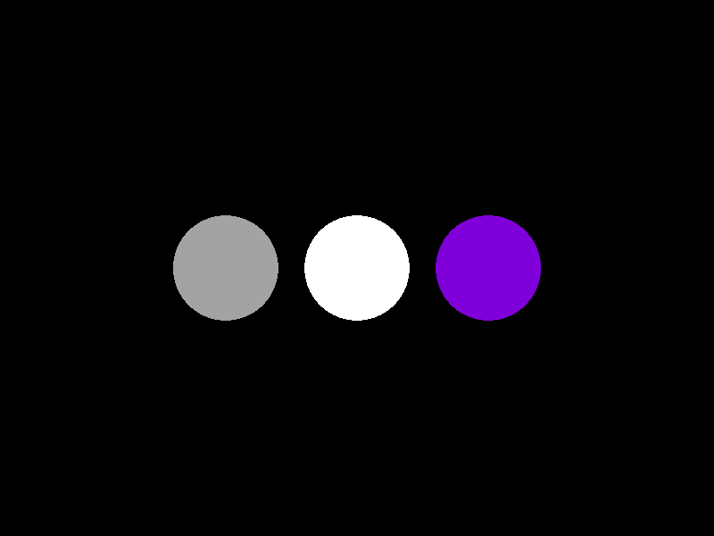

# Ray-Tracer-2.0

Last year I built a Ray Tracer using C++ with the Windows API to draw pixels to the screen. This year I've decided to create another (and hopefully more sophisticated) Ray Tracer, this time using C++ with SDL. 

This is a work in progress currently in development.

|Sphere Surface Color|
|--------------------|
||