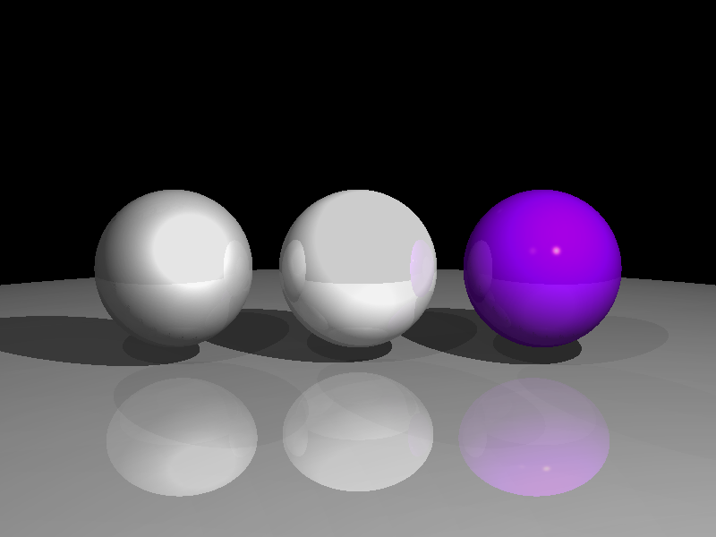
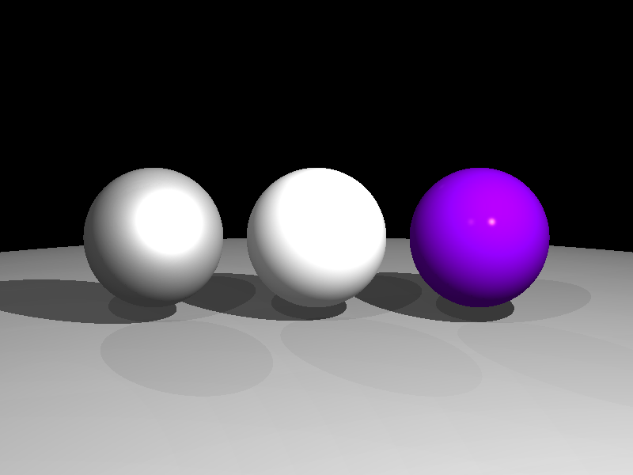
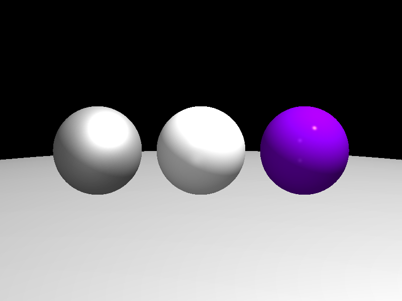
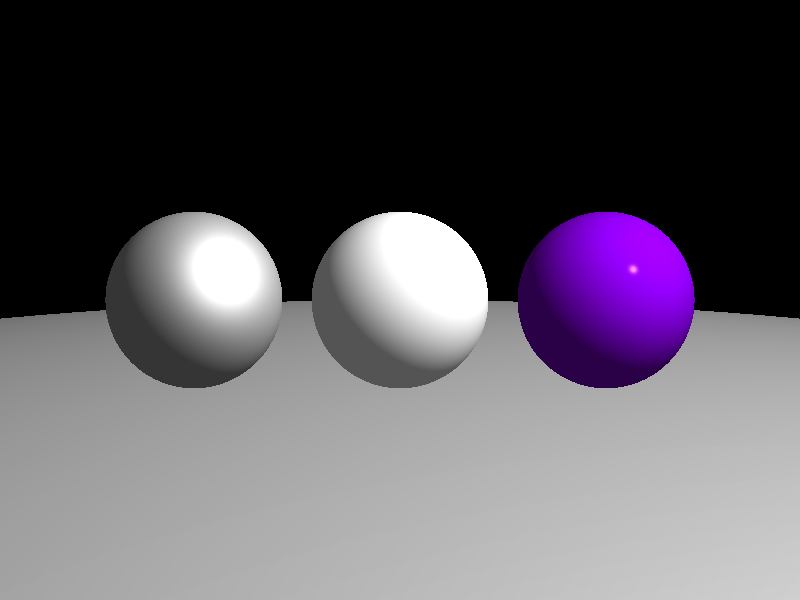
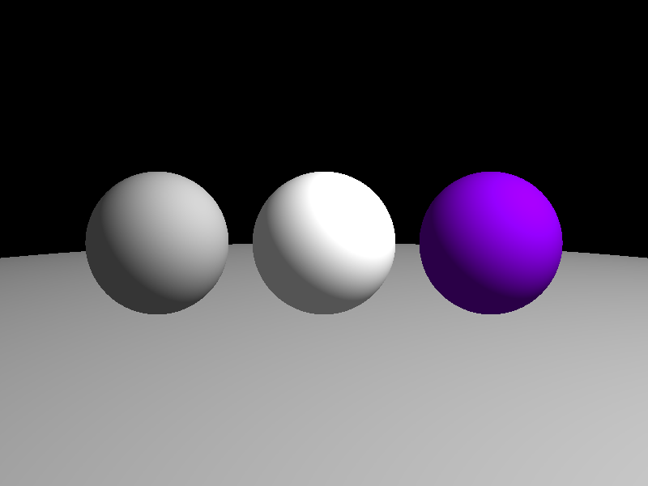
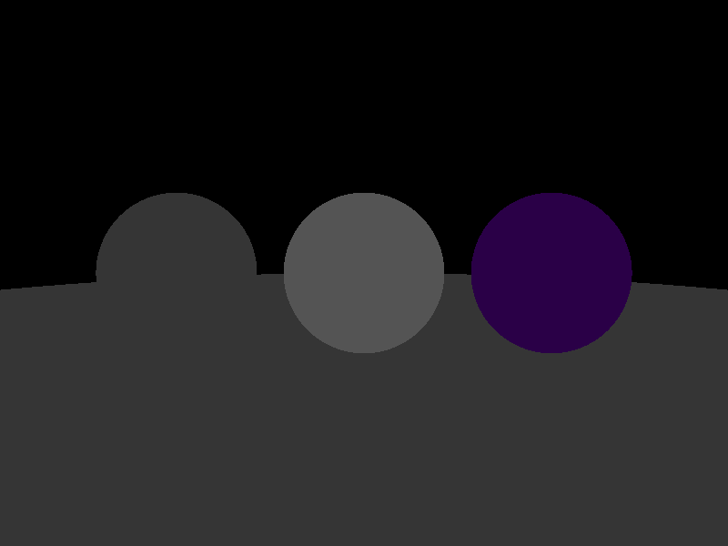
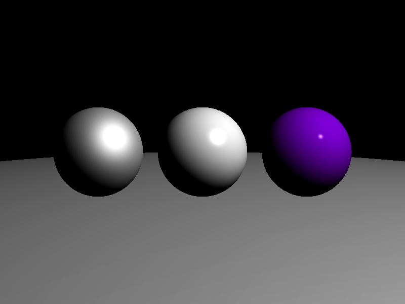
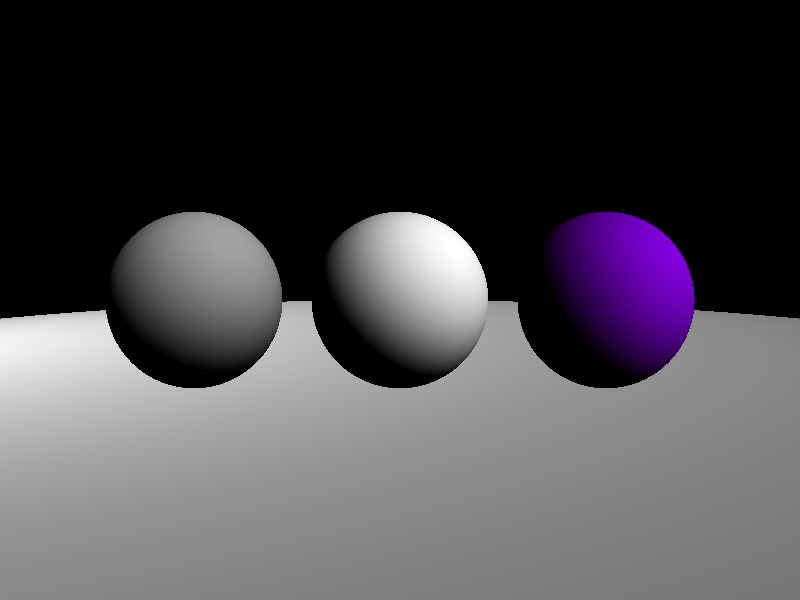

# Ray-Tracer-2.0

Last year I built a <a href="https://github.com/nicholaswile/3D-Rendering-Ray-Tracer">Ray Tracer</a> using C++ with the Windows API to draw pixels to the console. This year I've decided to create another (and hopefully more sophisticated) Ray Tracer using C++ with SDL. 

This is a work in progress currently in development. The following are features of my ray tracer in reverse order of development.

|Reflections|
|-----------|
||

|Shadows|
|-------|
||

|Multi-Point Lighting|
|--------------------|
||

|Blinn-Phong Shading with Ambient Lighting|
|-------------------------------------|
||

|Lambert Shading with Ambient Lighting|
|-------------------------------------|
||

|Ambient Lighting|
|-------|
||
Instead of completely black shading in dark areas, we can add an ambient light to each sphere based on its diffuse color. This will blend the shading better.

|Blinn-Phong Shading (specular component)|
|------------------------------|
||
Sphere materials vary in Phong exponent. From left to right, an "eggshell" material, a mildly shiny material, and a really glossy material.

|Lambert Shading|
|---------------|
||

|Triangle Ray (Möller–Trumbore intersection algorithm)|
|-------------------------|
||
For now I'm gonna focus on the spheres, but eventually I'd like to use this towards rendering 3D models comprised of triangle meshes.

|Sphere Surface Color|
|--------------------|
||

### External libraries
<ul>
<li>
<a href="https://github.com/libsdl-org/SDL">Simple DirectMedia Layer</a> (SDL) for windowing and input. Copyright (C) 1997-2020 Sam Lantinga <slouken@libsdl.org>
</li>
<li>
<a href="https://github.com/libsdl-org/SDL_image">SDL_image</a> for image decoding. Copyright (C) 1997-2024 Sam Lantinga <slouken@libsdl.org>
</li> 
</u
