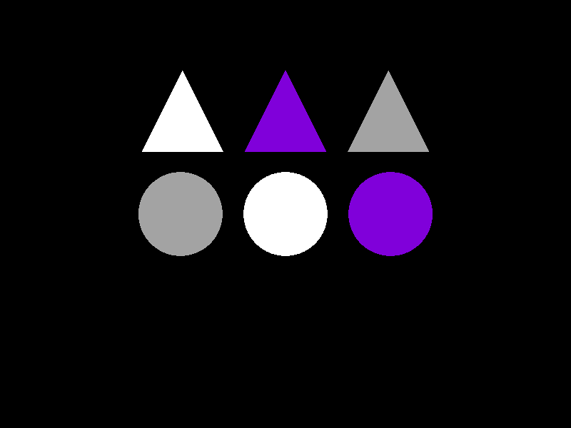
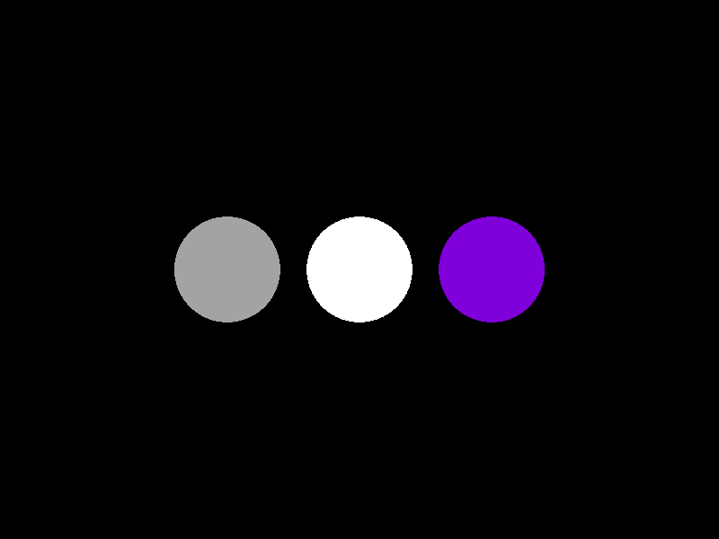

# Ray-Tracer-2.0

Last year I built a Ray Tracer using C++ with the Windows API to draw pixels to the console. This year I've decided to create another (and hopefully more sophisticated) Ray Tracer, this time using C++ with SDL. 

This is a work in progress currently in development.

|Triangle Ray (Möller–Trumbore intersection algorithm)|
|-------------------------|
||
For now I'm gonna focus on the spheres, but eventually I'd like to use this towards rendering 3D models comprised of triangle meshes.

|Sphere Surface Color|
|--------------------|
||

### External libraries
<ul>
<li>
<a href="https://github.com/libsdl-org/SDL">Simple DirectMedia Layer</a> (SDL) for windowing and input. Copyright (C) 1997-2020 Sam Lantinga <slouken@libsdl.org>
</li>
<li>
<a href="https://github.com/libsdl-org/SDL_image">SDL_image</a> for image decoding. Copyright (C) 1997-2024 Sam Lantinga <slouken@libsdl.org>
</li> 
</u
